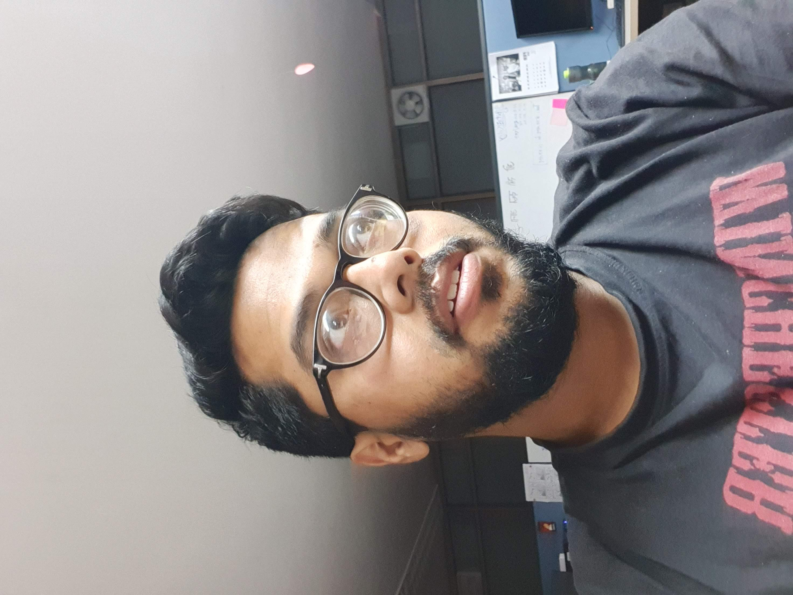

<table markdown=1>
<tr>
<td>
    
</td>
<td>

# Sunandan Adhikary
 

**Ph.D. Scholar**

 

**Department of Computer Science and Engineering**
 

**Indian Institute of Technology, Kharagpur**
 

**Email:**<a href="mailto:mesunandan@gmail.com">

_mesunandan@gmail.com_
</a> /  <a href="mailto:mesunandan@gmail.com">

_mesunandan@kgpian.iitkgp.ac.in_</a>

</td>
</tr>
<tr>
<td class="social">
    
    <a href="mailto:mesunandan@gmail.com"><svg aria-label="Mail" class="icon"><use xlink:href="/assets/fontawesome/icons.svg#envelope"></use></svg></a>
    <a href="https://github.com/SunandanAdhikary"><svg aria-label="Github" class="icon"><use xlink:href="/assets/fontawesome/icons.svg#github"></use></svg></a>
    <a href="https://scholar.google.com/citations?hl=en&user=VsnaXGoAAAAJ"><svg aria-label="Google Scholar" class="icon"><use xlink:href="/assets/fontawesome/icons.svg#google"></use></svg></a>
    <a href="https://www.youtube.com/channel/UCTzpx5WoEU6FYKBzrQEkymg"><svg aria-label="Youtube" class="icon"><use xlink:href="/assets/fontawesome/icons.svg#youtube"></use></svg></a>
    
</td>
<td>

I am a PhD student, currently persuing my research on the *Development of learning based safe and secure control strategies for CPS* under the guidance of [Prof. Soumyajit Dey](http://cse.iitkgp.ac.in/~soumya/){:target="_blank"} in [HiPRC lab](http://cse.iitkgp.ac.in/resgrp/hiprc/){:target="_blank"}.* and [Formal Methods Research Group](http://cse.iitkgp.ac.in/~fmres/){:target="_blank"}.
<!-- `Here’s to the fools who dream, Crazy as they may seem. Here’s to the hearts that ache. Here’s to the mess we make!` -->
</td></tr>

</table>

`    Here’s to the fools who dream, Crazy as they may seem. Here’s to the hearts that ache. Here’s to the mess we make!     `

<table markdown=1>
<tr>
<td class="topics">
## Work Area
</td>
<td>

- [Formal Methods](https://scholar.google.com/citations?view_op=search_authors&hl=en&mauthors=label:formal_verification){:target="_blank"}
- [Control Systems](https://scholar.google.com/citations?view_op=search_authors&hl=en&mauthors=label:control_theory){:target="_blank"}
- [Safe Reinforcement Learning](https://scholar.google.com/citations?view_op=search_authors&hl=en&mauthors=label:safe_reinforcement_learning){:target="_blank"}
- [Cyber-Physical Systems (CPS) Safety and Security](https://scholar.google.com/citations?view_op=search_authors&hl=en&mauthors=label:cps_security){:target="_blank"}

</td>
</tr>
<tr>
<td class="topics">

## Proficiencies
</td>
<td>

* **Languages** : *Bengali, English, Hindi*
* **Programming Languages** : *C, Embedded C, C++, Python, Java, PHP*
* **Tool-chains** : *Matlab, Simulink, z3, dReal, CBMC, Gurobi, Mosek, OpenAiGym*
</td>
</tr>
<tr>
<td rowspan= 4 class="topics">

## Education
</td>
<td>

 ### MS - 9.33 CGPA 
* [IIT Kharagpur](http://www.iitkgp.ac.in/){:target="_blank"} (2018-2021)
* [Department of Computer Science](https://cse.iitkgp.ac.in/){:target="_blank"}
* On the topic of **_EXPLORING PLATFORM AWARE FORMAL METHODS FOR SAFE AND SECURE CYBER-PHYSICAL SYSTEMS_**
Under the guidance of [Prof. Soumyajit Dey](http://cse.iitkgp.ac.in/~soumya/){:target="_blank"}, [Prof Aritra Hazra](https://cse.iitkgp.ac.in/~aritrah/){:target="_blank"}

</td>
</tr>
<tr>
<!-- <td></td> -->
<td>

### B.TECH - 8.18 CGPA
- [Kalyani Government Engineering College](https://www.kgec.edu.in/){:target="_blank"}
- Department of Electronics, and Communications
- WBUT (2011-2015)

</td>
</tr>
<tr>
<!-- <td></td> -->
<td>

### HIGHER SECONDARY – 90%
* [Krishnath College School](https://kncs.in/){:target="_blank"}
* Science Major (Maths, Physics, Chemistry)
* WBCHSE (2009-2011)

</td>
</tr>
<tr>
<!-- <td></td> -->
<td>

### SECONDARY – 87%
* [Krishnath College School](https://kncs.in/){:target="_blank"}
* WBBSE (2004-2009)

</td>
</tr>
<tr>
<td rowspan=2 class="topics">

## Publications
</td>
<td>

### Conference Papers
**Skip to secure: Securing cyber-physical control loops with intentionally skipped executions**  In *Proceedings of CCS pre-conference Joint Workshop on CPS&IoT Security and Privacy (CPSIOTSEC) 2020*
* Authors: **S. Adhikary**, I. Koley, S. K. Ghosh, S. Ghosh, S. Dey, and D. Mukhopadhyay.

</td>
</tr>
<tr>
<!-- <td></td> -->
<td>

### Journal Papers
**SMT-based Verification of Safety-CriticalEmbedded Control Software**  In *IEEE Embedded Systems Letters.*
* Authors: **Sunandan Adhikary**, Amit Gurung, Jay Thakkar, Antonio Bruto Da Costa, Aritra Hazra, Soumyajit Dey, Pallab Dasgupta

</td>
</tr>
<tr>
<td rowspan= 5 class="topics">

## Experiences
</td>
<td>

<!-- ### Academic  -->
### Teaching Assistant at *Indian Institute of Technology, Kharagpur*
* Formal Languages and Automata Theory, 
* Computer Organization and Architecture Lab, 
* High-Performance Computer Architecture, 
* Computational Foundations of Cyber-physical Systems, 
* Programming and Data Structures Theory

<tr>
<!-- <td></td> -->
<td>

### Research Consultant at *Indian Institute of Technology, Kharagpur*
* *February 2018 - 2021*
* An MHRD funded Project under the supervision of Prof. Pallab Dasgupta, Prof. Soumyajit Dey, and Prof Aritra Hazra. The goal of this project is to build a toolchain enabling SMT based Verification of Closed-loop implementation of Control software in the presence of timing anomalies and disturbances.

</td></tr>
<tr>
<!-- <td></td> -->
<td>
<!-- ### Industry  -->

### System Engineer at *Tata Consultancy Services in Kolkata & Chennai*
* *August 2015 - February 2018 (1 year)*
* Analysis and development of middle layer, back end and integration of Business Intelligence application for British Airways and Pizza Hut International using Java.
</td></tr>
<tr>
<!-- <td></td> -->
<td>

### Engineering Intern at *Bharat Sanchar Nigam Limited*
* *January 2013 - August 2014 (1year 8 months)*
* Employability Enhancement Training Program in BSNL. Getting acquainted with communication technologies and tools used by Bharat Sanchar Nigam.
</td></tr>
<tr>
<!-- <td></td> -->
<td>

### Summer Trainee at *Airport Authority of India, Kolkata*
* *July 2013 - August 2013 (2 months)*
* Hands-on with electronics and communication instruments used in the Airport.

</td>
</tr>
<tr>
<td class="topics">

## Achievements
</td>
<td>

* Awarded with National Merit Scholarships, 
* Ranked in several Robotics Competitions, 
* Ranked in National, State Level Drawing Contests,
* Won National Talent Search Medals
* Won several State Level Quiz Contests

</td>
</tr>

</table>

